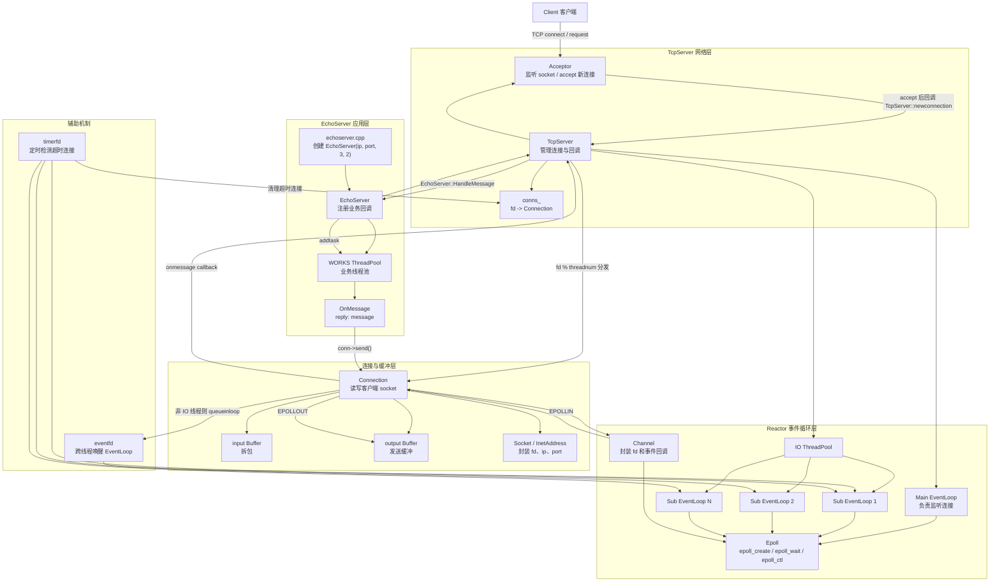

  EchoServer 采用主从 Reactor 模型。主 EventLoop 只负责监听服务端 socket 并接收新连接；TcpServer 将新连接按照 fd % threadnum 分发到多个 Sub EventLoop，每个 Sub EventLoop 独立运行在 IO 线程池中，通过 epoll 监听客户端读写事件。Connection 封装客户端连接，Channel 封装 fd 事件与回调，Buffer 负责收发缓冲和报文拆包。业务层 EchoServer 注册连接、关闭、错误、消息、发送完成等回调，收到消息后可投递到 WORKS 业务线程池处理，处理完成后通过 conn->send() 将响应交回对应 IO 线程发送。EventLoop 内部使用 eventfd 实现跨线程唤醒，使用 timerfd 定时清理超时连接。

