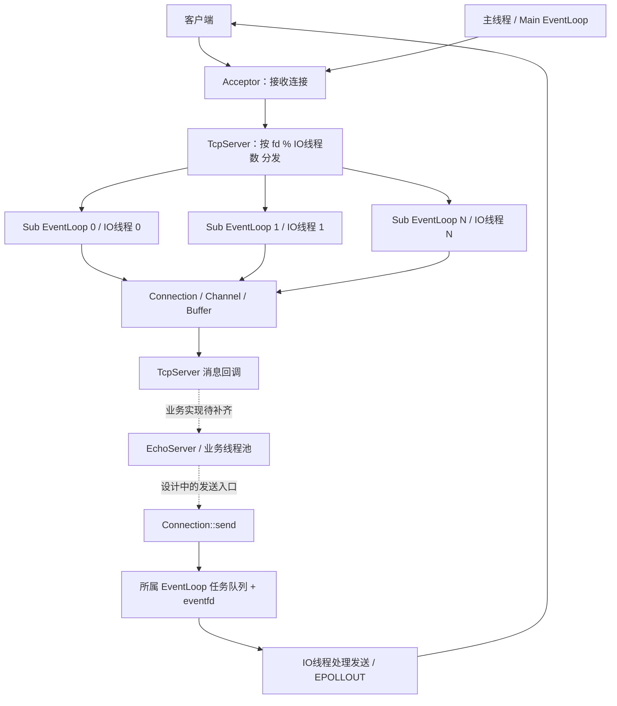

# EchoServer

基于 **C++ / Linux 主从 Reactor** 的 TCP 网络服务器实践项目，围绕连接接入、事件分发、非阻塞读写、消息缓冲、跨线程唤醒和空闲连接管理组织代码。

网络层由 `Socket`、`Channel`、`Epoll`、`EventLoop`、`Acceptor`、`Connection` 和 `TcpServer` 等组件组成，通过回调向业务层传递连接、消息、关闭及发送完成事件。业务层接口由 `EchoServer` 声明，项目同时提供线程池、客户端和基础 epoll 示例。

> **当前目录状态**：网络层源码基本齐全，但缺少 `EchoServer` 类的方法实现。`makefile` 引用了 `EchoServer.cpp`，目录中实际只有包含 `main()` 的 `echoserver.cpp` 和业务接口 `EchoServer.h`。因此，当前源码尚不能完整构建主服务器。本文区分现有实现、设计流程和待完善项，不宣称已达到百万连接或其他未经测试的性能指标。

## 1. 技术组成

| 技术 / 机制 | 当前用途 |
| --- | --- |
| C++ | 使用智能指针、回调、线程、互斥量、条件变量及原子变量组织组件 |
| Linux Socket API | 建立 IPv4 TCP 监听和客户端连接 |
| 主从 Reactor | 主事件循环接收连接，从事件循环处理客户端 IO |
| One Loop Per Thread | 每个从事件循环作为长期任务运行于一个 IO 工作线程 |
| epoll | 监听端使用 LT，客户端连接使用 ET |
| 非阻塞 IO / accept4 | 创建非阻塞监听 socket，并以 `SOCK_NONBLOCK` 接收连接 |
| eventfd | 唤醒 EventLoop，使其处理跨线程入队的任务 |
| timerfd | 定时触发空闲连接扫描 |
| Buffer | 保存收发数据，默认采用四字节长度报头 |
| ThreadPool | 提供任务队列与线程管理，供 IO 循环及业务层使用 |

建议后续统一使用 C++17 构建。当前 `makefile` 没有显式指定语言标准，不能将编译器默认值视为固定项目配置。

## 2. 架构与线程模型


```mermaid
flowchart TD
    Client[客户端] --> Acceptor[Acceptor：接收连接]
    Main[主线程 / Main EventLoop] --> Acceptor
    Acceptor --> Dispatch[TcpServer：按 fd % IO线程数 分发]
    Dispatch --> Loop0[Sub EventLoop 0 / IO线程 0]
    Dispatch --> Loop1[Sub EventLoop 1 / IO线程 1]
    Dispatch --> LoopN[Sub EventLoop N / IO线程 N]
    Loop0 --> Conn[Connection / Channel / Buffer]
    Loop1 --> Conn
    LoopN --> Conn
    Conn --> Callback[TcpServer 消息回调]
    Callback -. 业务实现待补齐 .-> Work[EchoServer / 业务线程池]
    Work -. 设计中的发送入口 .-> Send[Connection::send]
    Send --> Queue[所属 EventLoop 任务队列 + eventfd]
    Queue --> Write[IO线程处理发送 / EPOLLOUT]
    Write --> Client
```

图中的 `Connection` 节点表示各从循环分别管理的连接集合，每个连接只归属一个从循环。虚线部分依赖缺失的 `EchoServer` 业务实现，不代表当前目录已经提供完整执行链路。

### 主事件循环

- `Acceptor` 持有监听 socket 和对应 Channel。
- 监听端发生读事件后调用 `accept4()` 接收连接。
- `TcpServer` 按 `fd % threadnum` 选择从事件循环。

### 从事件循环

- 每个从循环拥有独立的 Epoll、连接容器、任务队列、eventfd 和 timerfd。
- Channel 保存关注的事件、返回的事件及处理回调。
- Connection 负责接收数据、拆分消息、缓存输出和处理连接状态。
- EventLoop 处理业务线程投递的发送任务和定时清理事件。

当前连接的构造和最初注册仍发生在主线程，尚未完全满足“连接状态只在所属 IO 线程修改”的约束，后续需要统一投递到所属 EventLoop。

### 业务层

`EchoServer.h` 声明了 `HandleMessage()`、`OnMessage()`、连接事件回调及业务线程池成员。其设计意图是通过回调连接网络层与业务层，并允许将业务任务交给线程池处理。

当前缺少这些方法的定义，因此不能从本地源码确认实际回复内容、线程池投递策略或完整业务停机顺序。

## 3. 文件与职责

| 文件 | 职责 |
| --- | --- |
| `echoserver.cpp` | 主服务器入口，解析地址和端口，创建 EchoServer，注册退出信号 |
| `EchoServer.h` | 业务服务器接口及成员声明；当前缺少配套实现文件 |
| `TcpServer.h/.cpp` | 组织主从 EventLoop，分发连接并转发业务回调 |
| `Acceptor.h/.cpp` | 监听 socket 和新连接接入 |
| `Socket.h/.cpp` | socket 生命周期、属性配置、bind/listen/accept |
| `InetAddress.h/.cpp` | IPv4 地址和端口封装 |
| `Epoll.h/.cpp` | epoll 注册、更新、删除及事件等待 |
| `Channel.h/.cpp` | fd 事件与回调的绑定和分发 |
| `EventLoop.h/.cpp` | 事件循环、跨线程任务队列、唤醒和超时扫描 |
| `Connection.h/.cpp` | 单连接收发、缓冲区、消息回调及连接状态 |
| `Buffer.h/.cpp` | 数据缓存与长度报头处理 |
| `ThreadPool.h/.cpp` | 工作线程、任务队列、条件变量和停止接口 |
| `Timestamp.h/.cpp` | 秒级时间记录与格式化 |
| `client.cpp` | 使用长度报头协议的 TCP 客户端示例 |
| `tcpepoll.cpp` | 独立的基础 epoll 通信示例，不属于主服务器的构建目标 |
| `tmp1.sh` | 启动多个客户端进程的示例脚本 |
| `makefile` | 客户端和主服务器的构建规则 |

目录中的 `client`、`echoserver`、`tcpepoll` 和 `test` 是已有产物，不能代替源码构建验证，也不能据此确认其与当前源码一致。

## 4. 环境与编译

### 4.1 运行环境

- Linux；Windows 下可使用 WSL 的 Linux 环境。
- 支持项目所用 C++ 特性的 `g++`，建议使用支持 C++17 的版本。
- GNU Make、Linux 开发头文件和线程库。
- 没有在现有构建规则中发现额外第三方网络库依赖。

源码直接使用 epoll、eventfd、timerfd 等 Linux 接口，不能直接作为普通 Windows 原生程序编译。

以下命令均在项目根目录的 **Linux shell** 中执行。

### 4.2 当前可单独构建的示例

```bash
make client
```

也可以显式指定语言标准并启用警告：

```bash
g++ -std=c++17 -O2 -Wall -Wextra -o client client.cpp
```

独立 epoll 示例可以单独构建：

```bash
g++ -std=c++17 -O2 -Wall -Wextra -o tcpepoll tcpepoll.cpp
```

这些是依据源码和构建规则整理的命令。本次文档编写未重新编译此本地版本，不表示已完成示例或主服务器的运行验证。

### 4.3 主服务器的构建前置条件

需要先恢复或补齐 `EchoServer` 类实现，再修正 `makefile` 中的源文件名称。

建议将业务实现文件命名为 `EchoServer_impl.cpp`，同时修改 `echoserver` 目标的依赖列表和编译命令，避免与入口文件 `echoserver.cpp` 仅有大小写差异。在常见 Windows 文件系统中，这类名称不能可靠区分。

补齐实现并更新构建规则后，再执行：

```bash
make -B
```

`-B` 用于强制重新构建，避免目录内旧二进制掩盖源码或构建问题。当前 Makefile 尚未建立完整的头文件依赖，也建议后续引入自动依赖生成或 CMake。

## 5. 启动方式与参数

以下是入口代码定义的命令格式，需在主服务器源码补齐并构建成功后使用。

终端一启动服务端：

```bash
./echoserver 127.0.0.1 5085
```

终端二启动客户端：

```bash
./client 127.0.0.1 5085
```

| 参数 | 含义 |
| --- | --- |
| `ip` | 服务端绑定的 IPv4 地址；客户端应填写可访问的服务端地址 |
| `port` | TCP 端口，例如 `5085` |

客户端循环发送 10000 条示例消息，并打印开始和结束时间。当前客户端没有完整处理短读、短写、异常长度和响应内容校验，不能作为严格的协议测试或性能基准。

入口注册了 `SIGINT` 和 `SIGTERM` 处理函数，可通过 Ctrl+C 或发送 SIGTERM 请求停止。当前实现直接在信号回调中操作线程和对象，停机可靠性仍需完善。

`tmp1.sh` 内写死了 `192.168.150.128:5085`，使用前应改成实际服务地址。它只负责启动多个客户端，不提供延迟分位数、错误率或资源统计。

## 6. 消息协议

**本地版本的 `Buffer` 默认参数是 `sep=1`，已启用四字节长度报头模式。**

```text
+------------------------+-----------------------------+
| 正文长度：4 字节        | 正文：length 字节           |
+------------------------+-----------------------------+
```

- 长度表示正文的字节数，不包含四字节报头；中文字符的字节数不等于字符数。
- `appendwithsep()` 写入长度和正文，`pickmessage()` 提取报文。
- Connection 使用独立的输入、输出 Buffer，收齐后通过消息回调交给上层。
- 当前长度编码直接复制整数内存，未统一网络字节序；发送缓冲区还直接取 `size_t` 的前四字节，存在跨平台兼容性问题。
- 当前业务实现缺失，回复正文的具体格式未在本地源码中确定。

| `sep` | 当前含义 | 完成状态 |
| --- | --- | --- |
| `0` | 无分隔符，取出当前全部缓存数据 | 有实现，但不提供应用层消息边界 |
| `1` | 四字节长度报头 | 默认启用，需要补报头完整性、非法长度和包长上限校验 |
| `2` | 注释预留 `\r\n\r\n` 分隔方式 | 未实现，不能视为已支持 HTTP |

不能假设一次 `send()` 对应一次 `recv()`。现有 Buffer 提供了缓存和拆包的基本结构，但解析前未检查是否至少有四字节头部，且没有充分校验负数或过大长度，尚不能保证正确处理所有半包、粘包和异常报文。

## 7. 当前默认配置

| 配置 | 当前值 | 位置 / 说明 |
| --- | --- | --- |
| 从 Reactor / IO 线程数 | `3` | `echoserver.cpp` 中传给 EchoServer 的参数 |
| 业务线程数参数 | `2` | `echoserver.cpp`；实际创建依赖缺失的业务实现 |
| 连接分发规则 | `fd % threadnum` | `TcpServer::newconnection()` |
| listen backlog | `128` | `Socket::listen()` 默认参数 |
| 单次 epoll 最大返回事件数 | `100` | `Epoll::MaxEvents`，不是最大连接数 |
| epoll 等待超时 | `10 秒` | `EventLoop::run()` |
| 从循环空闲阈值 | `10 秒` | `EventLoop(false, 5, 10)`，判断条件为超过阈值 |
| 从循环后续扫描间隔 | `5 秒` | 首次 timerfd 设为 10 秒，之后每次重新设为 5 秒 |
| 默认协议 | 四字节长度报头 | `Buffer(uint16_t sep=1)` |

空闲时间当前按“上次成功取出完整消息”更新，并非每次收到字节都更新。回收发生在扫描时刻，不能理解为恰好空闲 10 秒就关闭。

## 8. 已知限制与改进方向

以下依据当前本地源码整理；其他版本的运行结果不直接作为本地版本的验证结果。

| 优先级 | 问题 | 建议方向 |
| --- | --- | --- |
| 高 | 缺少 EchoServer 方法定义，构建规则引用缺失实现文件 | 恢复业务源码，使用明确区分的文件名并同步 Makefile |
| 高 | 新建连接的同一表达式同时读取 clientsock 和移动其所有权，参数求值顺序可能导致空指针访问 | 在移动前先保存 fd 和目标 Loop |
| 高 | 跨线程发送任务仅保存裸 this 和数据指针 | 队列任务持有连接共享所有权及独立消息数据 |
| 高 | Connection 在共享所有权和上层回调就绪前注册读事件 | 初始化完成后在所属 Loop 中注册连接 |
| 高 | 超时扫描在范围循环中删除当前 map 元素，且遍历与插入同步不完整 | 在所属 Loop 内统一管理连接，使用安全的删除迭代方式 |
| 高 | 普通关闭未同步移除 EventLoop 中的连接引用，关闭与超时流程分散 | 统一状态转换、事件注销、socket 关闭和容器移除 |
| 高 | 长度报头、客户端短读短写及边界校验不完整 | 明确固定宽度和字节序，补完整收发及异常帧处理 |
| 高 | 事件分发使用互斥分支，非阻塞收发错误处理不完整 | 完善读写状态机，处理 EINTR、EAGAIN、EOF、SIGPIPE 和致命错误 |
| 中 | 持任务队列锁执行回调，存在阻塞及重入死锁风险 | 短临界区交换任务，解锁后执行 |
| 中 | 线程池停止、信号退出和内部 fd 释放需要完善 | 定义任务排空策略、安全通知和资源所有权 |
| 中 | 缓冲区、任务队列没有容量控制 | 增加高低水位、队列上限和背压策略 |
| 中 | 缺少自动化测试与可复现性能报告 | 增加 CI、内存检查、协议测试和规范化压测 |

性能优化应在正确性问题修复后开展：减少缓冲区前端删除带来的搬移，降低重复唤醒和事件更新开销，比较 IO 线程直接处理与业务线程池处理的实际收益，再按连接规模评估定时器数据结构。

## 9. 验证计划

- **构建**：固定 C++17，启用常用警告，确保从源码完整构建。
- **协议**：覆盖不足四字节报头、正文分段、多帧连发、非法长度和大消息。
- **连接**：覆盖立即发包、半关闭、异常断连、重复关闭、空闲回收和慢客户端。
- **并发**：检查跨线程发送与关闭的生命周期，使用 ASan/UBSan，并独立运行 TSan 检查。
- **退出**：验证停止接入、业务任务处理、输出刷新、线程退出和 fd 释放。
- **性能**：记录环境、并发数、消息大小、测试时长、吞吐、P50/P95/P99、错误率、CPU、内存和 fd 数量。

目前目录未提供可复现的百万连接测试结果。项目路径名称、采用 epoll 或启动多个客户端，都不能作为并发容量结论。

## 10. 参考与来源

部分源文件保留了作者“吴从周”的教学示例注释。整理、修改和分享时应保留已有署名，并根据实际参考来源补充课程或原项目信息。当前目录未见独立 LICENSE 文件，本文不替原代码声明新的许可证。
